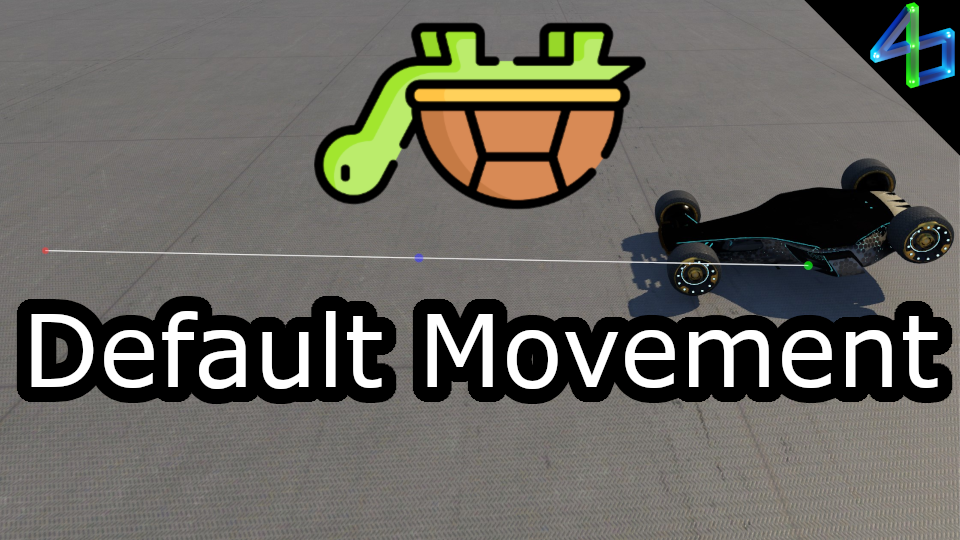

# Default Movement

When dead-turtled (upside-down with no wheel contact), this shows your "default movement" direction and how far you will go in a certain amount of time (currently 10 and 20 minutes). I was inspired to make this by playing no-checkpoint maps where a dead turtle may or may not mean the end of the run.

